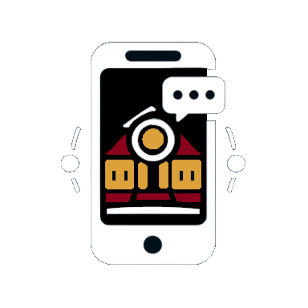

  
   
  <h1>CampusConnections</h1>
  
AR Campus Companion app for McMaster Students

  
McMaster University Undergraduate Software Engineering Capstone

 

Developer Names: Firas Elayan, Abhiram Neelamraju, Zihao Du, Matthew Miller, Michael Kim, Waseef Nayeem

Date of project start: September 18, 2023

This project is a social media app designed for people from McMaster University. It allows users to maximize their campus experiences with AR technologies and effectively connect with peers and resources in an increasingly digital age. With this product, users can look for events of their interest, find lecture rooms and make new friends virtually.

The folders and files for this project are as follows:

- docs - Documentation for the project
- refs - Reference material used for the project, including papers
- src - Source code
- test - Test cases
etc.